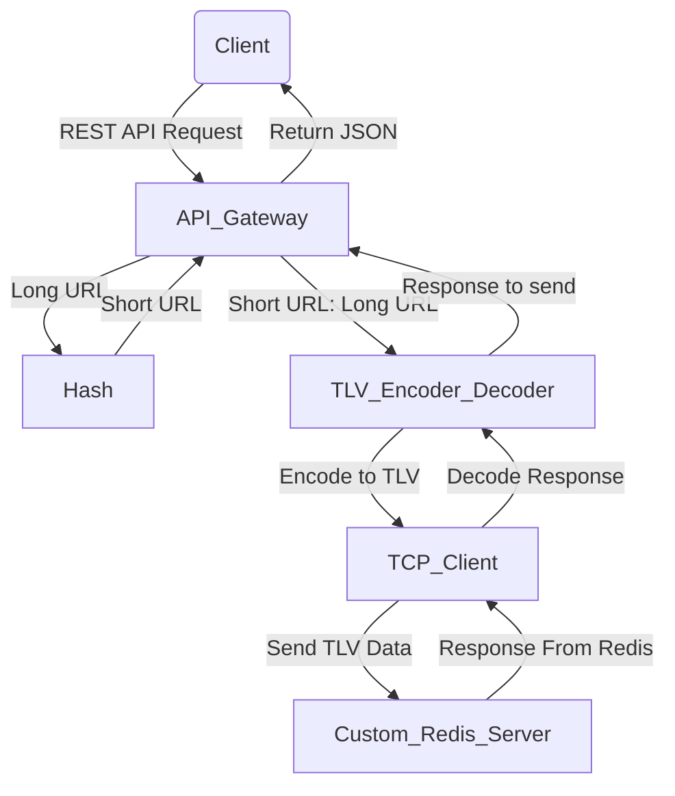
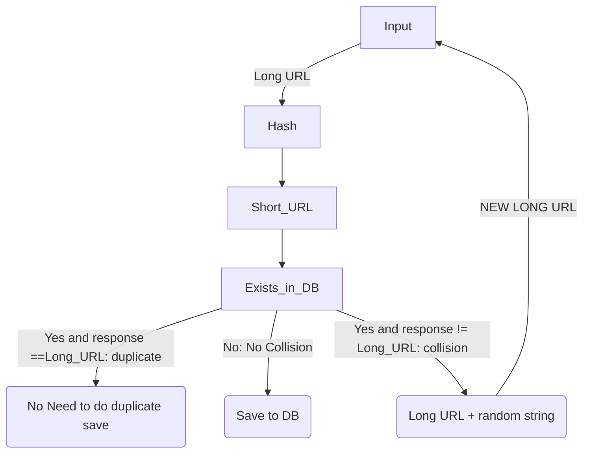

# Url-Shortner 


## Overview
This project is a Flask-based API Gateway and custom-redis server as database that:
- Accepts **REST API requests**.
- Hash the URL using **CRC32** on POST  
- **Encodes data in TLV format**.
- Sends the data to a **Redis Server using TCP** (written in C++).
- Stores data in **Redis** for in memory storage.
- **Parse** the TLV format response from Redis
- Send response to **REST API requests** 


## ⚡ Tech Stack
- **Backend:** Flask (Python)
- **Database:** Custom Redis
- **Protocol:** TCP Sockets
- **Testing:** Pytest

---

## 🔧 Setup Instructions

### Clone the Repository
```bash
git clone https://github.com/patel-lay/url-shortner-from-scratch.git
cd url-shortner-from-scratch
```

### Run redis server in another terminal
```bash
cd redis-from-scratch
make clean
make
./server
```
### Start the Falsk based API gateway
```bash
python3 app.py
```

### Example POST API requset
```bash
curl -X POST "http://127.0.0.1:4000/api" -H "Content-Type: application/json" -d '{"long_url": "https://codingchallenges.fyi/challenges/challenge-url-shortener"}'
```


### Example POST API response
```json
{
  "long_url": "https://codingchallenges.fyi/challenges/challenge-url-shortener",
  "message": "Short URL saved successfully",
  "short_url": "https://tinyurl.com/87026341"
}
```
### Example GET API request
```bash
curl -X GET "http://127.0.0.1:4000/api" -H "Content-Type: application/json" -d '{"short_url": "https://tinyurl.com/87026341"}'
```

### Example GET API resposne
```json
{
  "long_url": "https://codingchallenges.fyi/challenges/challenge-url-shortener",
  "message": "Long URl retrived successfully",
  "short_url": "https://tinyurl.com/87026341"
}
```

### System Diagram


### Handling hash collision and duplicate entry: 
This is inspired by Alex Xu design   
